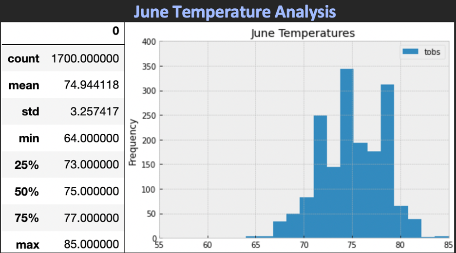
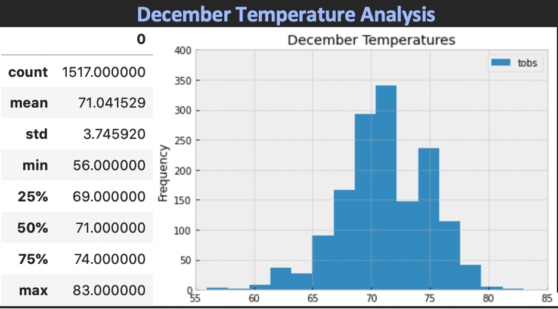
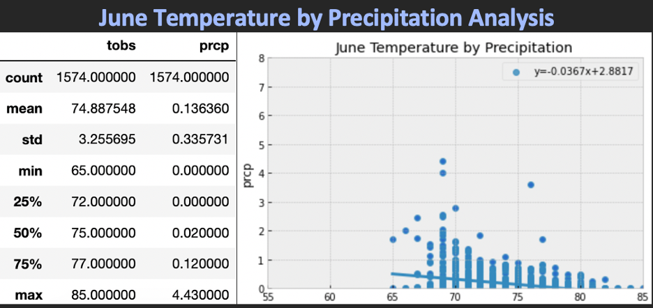
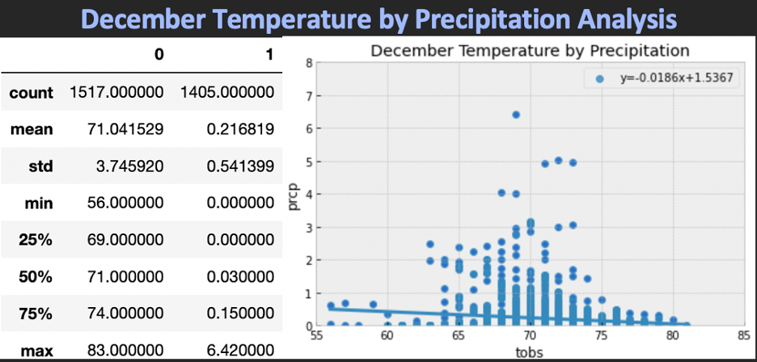

# Surfs_Up!
Advanced Data Storage and Retrieval 
## Overview of Analysis:
An investor wants to learn more about the weather before committing to build a Surf and Ice Cream shop in Oahu, Hawaii. The investor's main concern is the precipitation forcing the shop to close too frequently. To analyze Hawaii's weather data, SQLAlchemy was used to query the SQLite database.

[Python File](https://github.com/lindsayrosenthal/surfs_up/SurfsUp_Challenge.ipynb)

## Results: 

:cloud_with_rain: As an additional query, the June months were filtered from the date. The temperature and precipitation data was then graphed as a scatterplot with a trendline.

:cloud_with_rain: As an additional query, the December months were filtered from the date. The temperature and precipitation data was then graphed as a scatterplot with a trendline.

- 1. The mean temperature of 75°F for June is higher than the mean temperature of 71°F for December. However, the opposite is true for precipitation. December had the higher precipitation of .22 inches while June had .14 inches.
- 2. Grouping the data into more bins allows you to see a lot more detail in the data.
- 3. Considering it is two different seasons the numbers are relatively close. It would be a good area to open an ice cream/ surf shop
- 4. Reading the slopes of the trendlines, June's slope (-.037) has a slightly steeper slope than December's slope (-.019), which means as the temperature increases, the precipitation decreases slightly more in June than in December. 
- 5. The precipitation mostly stays under 3 inches, with a few outliers over 3 inches.
 
## Summary:

The investor's concern was that the weather would cause the ice cream shop to getrained out too frequently. If you compare the June and December data, the temperature and precipitation means are pretty close.  This means that the weather is reliable and that the data supports opening a Surf and Ice Cream shop year-round.
